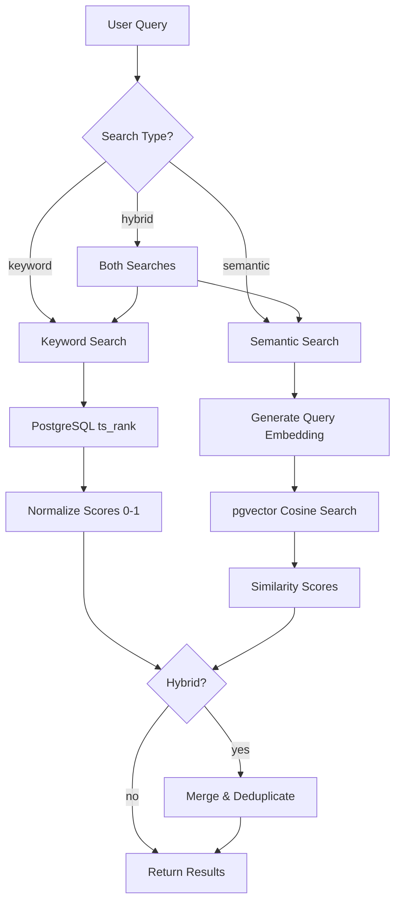
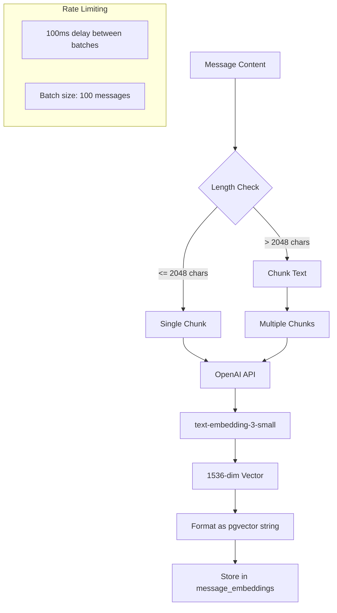
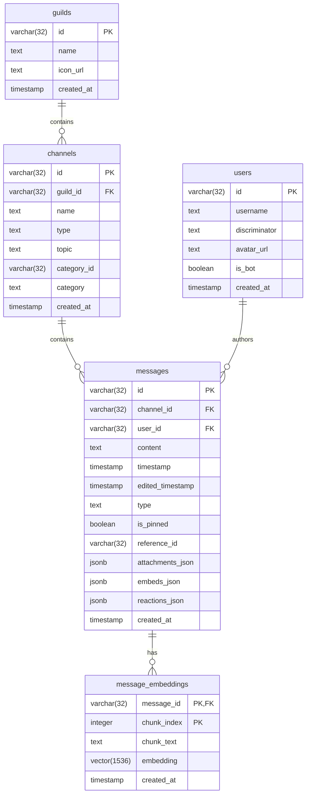
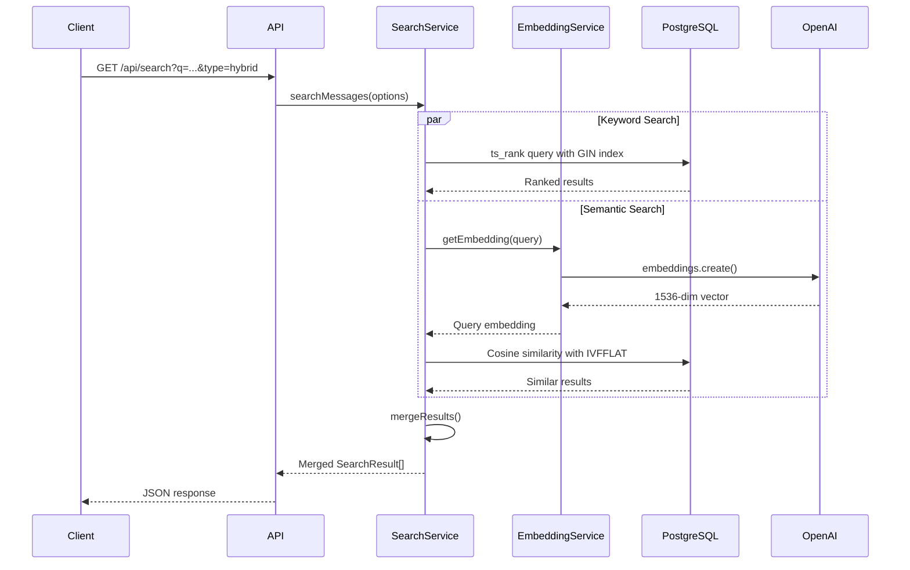
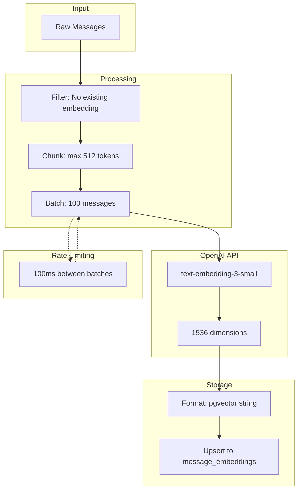
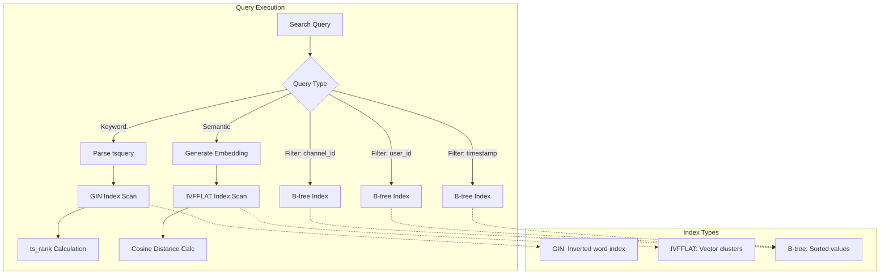

# Search System Technical Specification

This document provides comprehensive technical documentation for the Discord Analyzer search system, including implementation details, architecture diagrams, and API references.

## Table of Contents

1. [System Architecture Overview](#system-architecture-overview)
2. [Keyword Search (BM25-style)](#keyword-search-bm25-style)
3. [Semantic Search (Vector Similarity)](#semantic-search-vector-similarity)
4. [Hybrid Search](#hybrid-search)
5. [Database Schema](#database-schema)
6. [API Reference](#api-reference)
7. [Performance Characteristics](#performance-characteristics)
8. [Diagrams](#diagrams)

---

## System Architecture Overview

The search system implements three distinct search modes:

| Mode | Algorithm | Use Case |
|------|-----------|----------|
| **Keyword** | PostgreSQL full-text search with `ts_rank()` | Exact term matching, known phrases |
| **Semantic** | pgvector cosine similarity | Conceptual/meaning-based search |
| **Hybrid** | Merged keyword + semantic | Best overall results (default) |

### High-Level Search Flow



### Source Files

| File | Purpose |
|------|---------|
| `src/services/search.ts` | Core search algorithms |
| `src/services/embeddings.ts` | Embedding generation |
| `src/db/schema.ts` | Database schema definitions |
| `src/server/routes/search.ts` | API endpoints |

---

## Keyword Search (BM25-style)

### Algorithm

The keyword search uses PostgreSQL's built-in full-text search with BM25-style ranking through `ts_rank()`.

### Implementation Details

**Query Parsing:**
```sql
plainto_tsquery('english', <query>)
```
- Converts natural language to tsquery
- Applies English stemming and stop word removal
- Handles multi-word queries automatically

**Vector Generation:**
```sql
to_tsvector('english', content)
```
- Creates searchable text vector from message content
- Uses English language configuration for stemming

**Ranking Function:**
```sql
ts_rank(to_tsvector('english', content), plainto_tsquery('english', query), 1)
```

The normalization mode `1` divides the rank by `1 + log(document_length)`, providing BM25-like length normalization. This prevents longer documents from having an unfair advantage.

### Score Normalization

Raw `ts_rank` scores are normalized to a 0-1 range using max-normalization:

```typescript
const maxRank = Math.max(...results.map(r => r.rank || 0));
const normalizedScore = maxRank > 0 ? (rank || 0) / maxRank : 0;
```

This ensures scores are comparable across different result sets.

### Index Configuration

```sql
CREATE INDEX messages_content_search_idx
ON messages
USING gin(to_tsvector('english', content));
```

- **Index Type:** GIN (Generalized Inverted Index)
- **Language:** English
- **Column:** `content`

### SQL Query Pattern

```sql
SELECT
    m.id AS message_id,
    m.channel_id,
    c.name AS channel_name,
    m.user_id,
    u.username,
    m.content,
    m.timestamp,
    ts_rank(to_tsvector('english', m.content), plainto_tsquery('english', $1), 1) AS rank
FROM messages m
LEFT JOIN users u ON m.user_id = u.id
LEFT JOIN channels c ON m.channel_id = c.id
WHERE to_tsvector('english', m.content) @@ plainto_tsquery('english', $1)
    AND (channel_id = $2 OR $2 IS NULL)
    AND (user_id = $3 OR $3 IS NULL)
    AND (timestamp >= $4 OR $4 IS NULL)
    AND (timestamp <= $5 OR $5 IS NULL)
ORDER BY rank DESC
LIMIT $6 OFFSET $7;
```

---

## Semantic Search (Vector Similarity)

### Algorithm

Semantic search uses vector embeddings to find conceptually similar content, even when exact terms don't match.

### Embedding Model

| Property | Value |
|----------|-------|
| **Model** | `text-embedding-3-small` |
| **Provider** | OpenAI |
| **Dimensions** | 1536 |
| **Distance Metric** | Cosine |

### Text Chunking Strategy

Long messages are chunked before embedding generation:

```typescript
function chunkText(text: string, maxTokens: number = 512): string[]
```

**Chunking Parameters:**
- **Max Tokens:** 512
- **Approximate Characters:** `512 * 4 = 2048` characters per chunk
- **Break Strategy:** Sentence boundaries (periods, newlines)
- **Minimum Break Point:** 50% of max chunk size

**Algorithm:**
1. If text <= max characters, return as single chunk
2. Find break point at max characters
3. Look backward for sentence boundary (period or newline)
4. If found after 50% mark, break there
5. Otherwise, break at max characters
6. Repeat for remaining text

### Similarity Calculation

**Cosine Distance Operator:**
```sql
embedding <=> query_embedding::vector
```

The `<=>` operator calculates cosine distance (0 = identical, 2 = opposite).

**Conversion to Similarity:**
```typescript
const similarity = 1 - cosine_distance;
// Range: -1 to 1 (typically 0 to 1 for normalized vectors)
```

### Index Configuration

```sql
CREATE INDEX message_embeddings_embedding_idx
ON message_embeddings
USING ivfflat(embedding vector_cosine_ops);
```

- **Index Type:** IVFFLAT (Inverted File Flat)
- **Operator Class:** `vector_cosine_ops`
- **Purpose:** Approximate nearest neighbor search

### SQL Query Pattern

```sql
SELECT
    m.id AS message_id,
    m.channel_id,
    c.name AS channel_name,
    m.user_id,
    u.username,
    m.content,
    m.timestamp,
    1 - (me.embedding <=> $1::vector) AS similarity
FROM message_embeddings me
INNER JOIN messages m ON me.message_id = m.id
LEFT JOIN users u ON m.user_id = u.id
LEFT JOIN channels c ON m.channel_id = c.id
WHERE (channel_id = $2 OR $2 IS NULL)
    AND (user_id = $3 OR $3 IS NULL)
    AND (timestamp >= $4 OR $4 IS NULL)
    AND (timestamp <= $5 OR $5 IS NULL)
ORDER BY me.embedding <=> $1::vector
LIMIT $6 OFFSET $7;
```

### Embedding Generation Pipeline



---

## Hybrid Search

### Merge Strategy

Hybrid search combines keyword and semantic results using a score-based merge with deduplication.

### Algorithm

```typescript
function mergeResults(
    keywordResults: SearchResult[],
    semanticResults: SearchResult[],
    limit: number
): SearchResult[] {
    const seen = new Set<string>();
    const merged: SearchResult[] = [];

    // Combine and sort by score (descending)
    const all = [...keywordResults, ...semanticResults]
        .sort((a, b) => b.score - a.score);

    // Deduplicate by messageId
    for (const result of all) {
        if (!seen.has(result.messageId)) {
            seen.add(result.messageId);
            merged.push(result);

            if (merged.length >= limit) break;
        }
    }

    return merged;
}
```

### Characteristics

| Property | Behavior |
|----------|----------|
| **Score Comparison** | Direct comparison (both normalized to 0-1) |
| **Deduplication** | By `messageId` |
| **Ordering** | Highest score first |
| **Limit Handling** | Applied after merge |

### Execution Flow


---

## Database Schema

### Entity Relationship Diagram



### Messages Table

```sql
CREATE TABLE messages (
    id VARCHAR(32) PRIMARY KEY,
    channel_id VARCHAR(32) NOT NULL REFERENCES channels(id),
    user_id VARCHAR(32) NOT NULL REFERENCES users(id),
    content TEXT NOT NULL,
    timestamp TIMESTAMP NOT NULL,
    edited_timestamp TIMESTAMP,
    type TEXT NOT NULL,
    is_pinned BOOLEAN DEFAULT FALSE NOT NULL,
    reference_id VARCHAR(32),
    attachments_json JSONB,
    embeds_json JSONB,
    reactions_json JSONB,
    created_at TIMESTAMP DEFAULT NOW() NOT NULL
);
```

**Indexes:**

| Index Name | Type | Column(s) | Purpose |
|------------|------|-----------|---------|
| `messages_channel_id_idx` | B-tree | `channel_id` | Filter by channel |
| `messages_user_id_idx` | B-tree | `user_id` | Filter by user |
| `messages_timestamp_idx` | B-tree | `timestamp` | Date range queries |
| `messages_content_search_idx` | GIN | `to_tsvector('english', content)` | Full-text search |

### Message Embeddings Table

```sql
CREATE TABLE message_embeddings (
    message_id VARCHAR(32) NOT NULL REFERENCES messages(id) ON DELETE CASCADE,
    chunk_index INTEGER NOT NULL DEFAULT 0,
    chunk_text TEXT NOT NULL,
    embedding VECTOR(1536) NOT NULL,
    created_at TIMESTAMP DEFAULT NOW() NOT NULL,
    PRIMARY KEY (message_id, chunk_index)
);
```

**Indexes:**

| Index Name | Type | Column(s) | Purpose |
|------------|------|-----------|---------|
| Primary Key | B-tree | `(message_id, chunk_index)` | Uniqueness, lookups |
| `message_embeddings_embedding_idx` | IVFFLAT | `embedding vector_cosine_ops` | Vector similarity search |

### Index Type Comparison

| Index Type | Use Case | Characteristics |
|------------|----------|-----------------|
| **B-tree** | Equality, range queries | Exact, fast for scalar values |
| **GIN** | Full-text search, arrays | Inverted index for text tokens |
| **IVFFLAT** | Vector similarity | Approximate NN, fast for high dimensions |

---

## API Reference

### GET /api/search

Primary search endpoint supporting all three search modes.

**Query Parameters:**

| Parameter | Type | Required | Default | Description |
|-----------|------|----------|---------|-------------|
| `q` | string | Yes | - | Search query text |
| `channel` | string | No | - | Filter by channel ID |
| `user` | string | No | - | Filter by user ID |
| `from` | ISO 8601 | No | - | Start date filter |
| `to` | ISO 8601 | No | - | End date filter |
| `type` | enum | No | `hybrid` | Search type: `keyword`, `semantic`, `hybrid` |
| `limit` | integer | No | `20` | Maximum results |
| `offset` | integer | No | `0` | Pagination offset |

**Response Format:**

```json
{
    "results": [
        {
            "messageId": "1234567890",
            "channelId": "9876543210",
            "channelName": "general",
            "userId": "1111111111",
            "username": "john_doe",
            "content": "Message content here",
            "timestamp": "2024-01-15T10:30:00.000Z",
            "score": 0.95
        }
    ],
    "total": 15,
    "query": "search terms",
    "filters": {
        "channel": null,
        "user": null,
        "from": null,
        "to": null,
        "type": "hybrid"
    }
}
```

**Example Requests:**

```bash
# Basic hybrid search
GET /api/search?q=meeting%20notes

# Keyword search in specific channel
GET /api/search?q=bug%20report&channel=123456&type=keyword

# Semantic search with date range
GET /api/search?q=project%20discussion&type=semantic&from=2024-01-01&to=2024-06-30

# Paginated results
GET /api/search?q=announcement&limit=10&offset=20
```

### GET /api/search/compare

Comparison endpoint returning results from all three search methods simultaneously.

**Query Parameters:**

Same as `/api/search` except `type` is not applicable (all types are returned).

**Response Format:**

```json
{
    "results": {
        "keyword": [
            {
                "messageId": "...",
                "score": 0.89,
                ...
            }
        ],
        "semantic": [
            {
                "messageId": "...",
                "score": 0.92,
                ...
            }
        ],
        "hybrid": [
            {
                "messageId": "...",
                "score": 0.92,
                ...
            }
        ]
    },
    "query": "search terms",
    "filters": {
        "channel": null,
        "user": null,
        "from": null,
        "to": null
    }
}
```

**Use Case:** Research and comparison of search algorithm effectiveness.

### Error Responses

| Status Code | Error | Description |
|-------------|-------|-------------|
| 400 | `Query parameter "q" is required` | Missing search query |
| 500 | `Search failed` | Internal server error |
| 500 | `Compare search failed` | Comparison endpoint error |

---

## Performance Characteristics

### Query Timing Expectations

| Search Type | Typical Latency | Factors |
|-------------|----------------|---------|
| **Keyword** | 10-50ms | GIN index efficiency, result count |
| **Semantic** | 50-200ms | Embedding API call (~30-100ms) + IVFFLAT search |
| **Hybrid** | 100-300ms | Both searches in parallel + merge overhead |

### Index Performance Profiles

**GIN Index (Full-text):**
- Fast lookup for common terms
- Handles stop words efficiently
- Performance degrades with very common terms

**IVFFLAT Index (Vector):**
- Approximate nearest neighbor (configurable accuracy)
- Faster than exact search for large datasets
- Requires periodic reindexing for optimal performance

### Scalability Considerations

| Dataset Size | Keyword Search | Semantic Search |
|--------------|----------------|-----------------|
| < 100K messages | Excellent | Excellent |
| 100K - 1M messages | Good | Good (may need IVFFLAT tuning) |
| > 1M messages | Good | Consider HNSW index |

### Optimization Recommendations

1. **IVFFLAT Lists:** For >1M embeddings, consider:
   ```sql
   CREATE INDEX ... USING ivfflat (...) WITH (lists = 100);
   ```

2. **Partial Indexes:** For frequently filtered channels:
   ```sql
   CREATE INDEX ON messages USING gin(to_tsvector('english', content))
   WHERE channel_id = 'frequently_searched_channel';
   ```

3. **Query Caching:** Consider caching embedding vectors for repeated queries.

---

## Diagrams

### Complete Search Flow Diagram



### Embedding Generation Pipeline



### Database Index Usage Flow



---

## Appendix

### TypeScript Interfaces

```typescript
// Search Options
interface SearchOptions {
    query: string;
    channelId?: string;
    userId?: string;
    fromDate?: Date;
    toDate?: Date;
    hasAttachments?: boolean;
    limit?: number;
    offset?: number;
    searchType?: 'semantic' | 'keyword' | 'hybrid';
}

// Search Result
interface SearchResult {
    messageId: string;
    channelId: string;
    channelName: string;
    userId: string;
    username: string;
    content: string;
    timestamp: Date;
    score: number;
    highlightedContent?: string;
}

// Compare Search Result
interface CompareSearchResult {
    keyword: SearchResult[];
    semantic: SearchResult[];
    hybrid: SearchResult[];
}

// Embedding Options
interface EmbeddingOptions {
    channelId?: string;
    batchSize?: number;
    force?: boolean;
    onProgress?: (processed: number, total: number) => void;
}

// Embedding Stats
interface EmbeddingStats {
    totalMessages: number;
    embeddedMessages: number;
    pendingMessages: number;
    coverage: number;
}
```

### Environment Variables

| Variable | Purpose |
|----------|---------|
| `OPENAI_API_KEY` | Required for semantic search |
| `DATABASE_URL` | PostgreSQL connection with pgvector |

### Dependencies

| Package | Version | Purpose |
|---------|---------|---------|
| `openai` | ^4.x | Embedding generation |
| `drizzle-orm` | ^0.x | Database ORM |
| `pgvector` | - | Vector extension for PostgreSQL |
